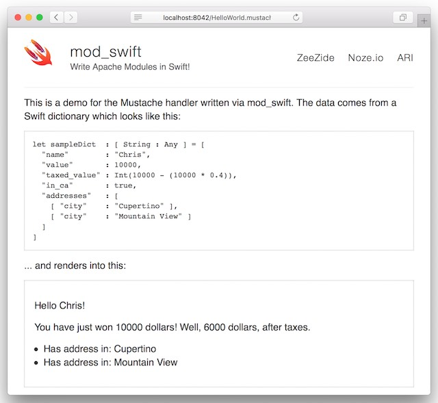

<h2>mod_swift
  
</h2>


**mod_swift** is a technology demo which shows how to write native modules
for the
[Apache Web Server](https://httpd.apache.org)
in the 
[Swift 3](http://swift.org/)
programming language.
The demo includes a 
[C module to load Swift modules](mod_swift/README.md),
a [basic demo module](mods_baredemo/README.md),
the [ApacheExpress](ApacheExpress/README.md) framework which provides an Express 
like API for mod_swift,
a [demo for ApacheExpress](mods_expressdemo/README.md),
a [Todo MVC](mods_todomvc/README.md) backend,
and a few supporting libraries
(such as Freddy or Noze.io [Mustache](ThirdParty/mustache/README.md)).

**Server Side Swift the [right](http://www.alwaysrightinstitute.com/) way**.
Instead of reinventing the HTTP server, hook into something that just works
and is battle proven. 
And comes with HTTP/2 as well as TLS support out of the box 🤓
(If you don't care, [Noze.io](http://noze.io) might be something for you.)


### What is an Apache module?

Well, Apache is a highly modular and efficient server framework. The httpd
daemon itself is quite tiny and pretty much all webserver functionality is
actually implemented in the form of
[modules](https://httpd.apache.org/docs/2.4/mod/).
Be it thread handling, access control, mime detection or content negotation -
all of that is implemented as modules. And can be replaced by own modules!

The Apache core modules are written in portable C. Some modules are built
right into the server, but most are loaded as
[dynamic libraries](https://developer.apple.com/library/content/documentation/DeveloperTools/Conceptual/DynamicLibraries/000-Introduction/Introduction.html).
Which ones is specified by the user in the
[configuration file](https://httpd.apache.org/docs/2.4/configuring.html), e.g.:

    LoadModule authz_core_module /usr/libexec/apache2/mod_authz_core.so
    LoadModule mime_module       /usr/libexec/apache2/mod_mime.so

Now with **mod_swift** you can write such modules using the
[Swift](http://swift.org/)
programming language. Enter:

    LoadSwiftModule ApacheMain /usr/libexec/apache2/mods_demo.so

This is a little different to something like `mod_php` which enables Apache
to directly interpret PHP scripts. `mod_php` itself is C software and a single
module.
Since Swift compiles down to regular executable binaries,
and because Swift has excellent 
[C integration](https://developer.apple.com/library/content/documentation/Swift/Conceptual/BuildingCocoaApps/InteractingWithCAPIs.html#//apple_ref/doc/uid/TP40014216-CH8-ID17),
you can write arbitrary modules with **mod_swift** which behave just like the
regular C modules.

### This is boring, show us something!

OK, ok.
So in short with **mod_swift** you can extend Apache in many many ways,
or just write dynamic HTTP endpoints,
be it dynamically generated web pages or web services.
There is no interpreter or JVM or proxy, the compiled Swift code runs directly
as part of Apache - a.k.a. superfast.
Here is your screenshot:



and here is some code used to generate that page (shortened,
[full](Sources/mods_demo/MustacheHandler.swift)):

```Swift
let sampleDict  : [ String : Any ] = [
  "name"        : "Chris",
  "value"       : 10000,
  "taxed_value" : Int(10000 - (10000 * 0.4))
]

func MustacheHandler(p: UnsafeMutablePointer<request_rec>?) -> Int32 {
  var req = ZzApacheRequest(raw: p!) // make it nicer to use
  guard req.handler == "de.zeezide.mustache" else { return DECLINED }
  
  req.contentType = "text/html; charset=ascii"
  guard let fn = req.filename else { return HTTP_NOT_FOUND }
  
  guard let template = try? String(contentsOfFile: fn) else {
    return HTTP_INTERNAL_SERVER_ERROR
  }
  req.puts(MustacheParser().parse(string: template).render(object: sampleDict))
  return OK
}
```

What this does is it loads a
[Mustache](http://mustache.github.io)
template 
[located in the Apache documents directory](DocRoot/HelloWorld.mustache).
It then resolves the template from some Swift dictionary and returns the result
to the browser.
Note that the file lookup and all that is managed by other Apache modules,
this handler is just invoked for Mustache templates
([as configured in our apache.conf](apache.conf#L44)).

Remember that this is just a proof of concept. Quite likely you'd want some
wrapper library making the Apache API a little 'Swiftier'.
Also remember that you can use this not only to deliver dynamic content,
but you can also use it to add new authentication modules to Apache,
or write new filter modules (say one which converts XML to JSON on demand).


### Know what? This looks awkwardly difficult ...

Fair enough. So we integrated a tiny subset of 
[Noze.io](http://noze.io/)
to allow you to do just that. This is what it looks like:

```Swift
func expressMain() {
  apache.onRequest { req, res in
    res.writeHead(200, [ "Content-Type": "text/html" ])
    try res.end("<h1>Hello World</h1>")
  }
}
```

And is configured like this in the Apache conf:

    <LocationMatch /express/*>
      SetHandler de.zeezide.ApacheExpress
    </LocationMatch>

Now you are saying, this is all nice and pretty. But what about Connect?
I want to write and reuse middleware!
Here you go:

```Swift
func expressMain() {
  let app = apache.connect()
  
  app.use { req, res, next in
    console.info("Request is passing Connect middleware ...")
    res.setHeader("Content-Type", "text/html; charset=utf-8")
    // Note: we do not close the request, we continue with the next middleware
    try next()
  }
  
  app.use("/express/connect") { req, res, next in
    try res.write("<p>This is a random cow:</p><pre>")
    try res.write(vaca())
    try res.write("</pre>")
    res.end()
  }
}
```

And Express? Sure, the Apache Express is about to leave:
```Swift
let app = apache.express(cookieParser(), session())

app.get("/express/cookies") { req, res, _ in
  // returns all cookies as JSON
  try res.json(req.cookies)
}

app.get("/express/") { req, res, _ in
  let tagline = arc4random_uniform(UInt32(taglines.count))
  
  let values : [ String : Any ] = [
    "tagline"     : taglines[Int(tagline)],
    "viewCount"   : req.session["viewCount"] ?? 0,
    "cowOfTheDay" : cows.vaca()
  ]
  try res.render("index", values)
}
```

Yes. All that is running within Apache.
The working example can be found here:
[ExpressMain.swift](mods_expressdemo/Sources/ExpressMain.swift#L9).
The [TodoMVC](mods_todomvc/Sources/TodoMVCMain.swift) is pretty neat too.


### This is wicked! How can I try it?

Easy! Just clone this repository, make and run it:

    git clone https://github.com/AlwaysRightInstitute/mod_swift.git
    cd mod_swift
    make run

Then open [http://localhost:8042/](http://localhost:8042/) and voilà,
you should see a webpage delivered by Apache.

It works out of the box on macOS 10.11+ with Xcode 8 
and the builtin system Apache (no Apache install required!),
with the Homebrew Apache 2.4 on macOS (`brew install homebrew/apache/httpd24`),
and on Linux (tested with Ubuntu 16.04).

On Linux you need to hack `/usr/include/apr-1.0/apr.h` and add a
`typedef int pid_t;` just below the MingW section to make swiftc behave.

To explore and hack the code, just open the `UseMe.xcworkspace`.
You can run everything directly from within Xcode.

Don't be afraid, the Apache invoked here doesn't interfere with your system
Apache at all (but uses it, Apache is part of all macOS installs).
It uses the [apache.conf](apache.conf) included in this repo,
runs against the [DocRoot](DocRoot/) included in this repo
and loads the libraries from the Xcode build dir (hardcoded to SRCROOT/.libs).

You want an intro into Apache module programming?
Try this: [Developing modules for the Apache HTTP Server 2.4](https://httpd.apache.org/docs/2.4/developer/modguide.html).

### Various Notes of Interest

- The code is 
  [properly formatted](http://www.alwaysrightinstitute.com/swifter-space/),
  max width 80 chars, 2-space indent.
- ApacheExpress is just code copy/pasted in from Noze.io. It may very well be
  non-sensical in the context of Apache :-)
- This doesn't use `apxs` because that is badly b0rked on both 10.11 and 10.12.
- It uses a lot of hardcoded load and lookup pathes, remember, it is a demo!
- It has some leaks and issues, e.g. modules are not properly unloaded.
- Sure, you can link against arbitrary Swift dylibs, 
  [mustache](Sources/mustache/) is an example for exactly that.
- However, you currently cannot use the Swift Package Manager to create
  dylibs (AFAIK). So while in theory that would work, you need to do the
  final linking step separately.
- Yes `mod_swift` itself could be avoided by including the .c in the Swift
  module. Yes, you can even statically link Swift including its runtime. Let
  me know if this is interesting, I have a branch which does exactly that.
- There is one big bet in the code: Officially there is no way to invoke a
  Swift function from C, only the other way around!
  In other words: it is pure luck that 
  [this works](Sources/mod_swift/mod_swift.c#L47) and is ABI compatible with C.
- If you would want to debug the stuff in Xcode - `/usr/sbin/httpd` is under
  [macOS SIP](https://support.apple.com/en-us/HT204899).
- On macOS 10.11 starting Apache with -X crashes a few seconds after the last
  request was received. Maybe just SIGPIPE or sth. 10.12 looks fine.
- Unloading is an issue. I think the Apple and GNUstep Objective-C
  runtimes cannot be properly unloaded (I've heard there is a great runtime
  that can).
  No idea what the situation with 'pure Swift' is.
- Would be cool if Swift 4 would get a proper `extern C {}`.
- Yes, Apache content handlers are not [Noze.io](http://noze.io/) like 
  asynchronous but run in a traditional, synchronous thread-setup.
- Apache varargs funcs are not available since Swift doesn't support such. We
  provide a wrapper for `ap_log_rerror_`, other funcs would need to be wrapped
  the same way.
- Apache also uses quite a few `#define`s, e.g. `ap_fwrite`
- The Apache C headers are prone to crash `swiftc`. Which is why we wrap the
  Apache `request_rec` in an additional struct.

              (__)
            /  .\/.     ______
           |  /\_|     |      \
           |  |___     |       |
           |   ---@    |_______|
        *  |  |   ----   |    |
         \ |  |_____
          \|________|
    [CompuCow Discovers Bug in Compiler](http://zeezide.com/en/products/codecows/index.html)

Oh, ages ago I did
[mod_objc](https://github.com/AlwaysRightInstitute/mod_objc1)
for Apache 1.3.

### Status

This is a demo. Do not use it for realz.

### Who

**mod_swift** is brought to you by
[The Always Right Institute](http://www.alwaysrightinstitute.com)
and
[ZeeZide](http://zeezide.de).
We like feedback, GitHub stars, cool contract work,
presumably any form of praise you can think of.
We don't like people who are wrong.

There is a `#mod_swift` channel on the [Noze.io Slack](http://slack.noze.io).
